# 📊 Análise de Fraudes em Transações Online com SQL
Este repositório contém um projeto de análise de fraudes em compras online utilizando SQL. O objetivo é explorar um dataset de transações, identificar padrões de fraude e fornecer insights valiosos para a mitigação de riscos financeiros.

## 🔍 Objetivo do Projeto
O principal objetivo deste projeto é analisar dados transacionais e detectar comportamentos fraudulentos. A partir dos dados de compras, foram realizadas diversas consultas SQL para responder perguntas-chave, como:

* Qual a porcentagem de transações fraudulentas?
* Quais são as características demográficas (idade, gênero) mais propensas à fraude?
* Existe um padrão de fraudes em termos de dispositivos, navegadores ou horários de compra?
* Quanto foi o prejuízo total causado por fraudes?

🛠️ Ferramentas Utilizadas
- Dataset: [Fraud ecommerce - Kaggle](https://www.kaggle.com/datasets/vbinh002/fraud-ecommerce/data) 
- SQL: Para manipulação e consulta dos dados.
- MySQL Workbench: SGBD utilizado para rodar as queries.

## 🔑 Resultados das consultas:
1. Conhecimento Inicial do Dataset

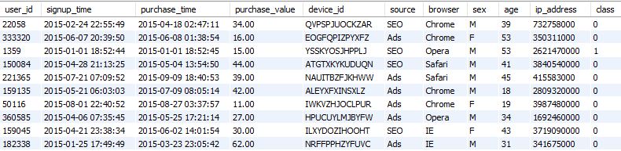

2. Total de transações com fraude

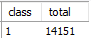

3. Percentual de transações com fraude

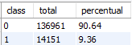

4. Faturamento por class(0 - sem fraude/ 1 - com fraude

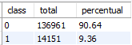

5. Intervalo entre cadastro e compra

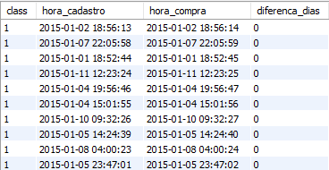

6. Análise por faixa etária

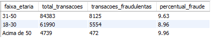

7. Análise por gênero

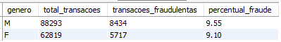

8. Análise por hora do dia

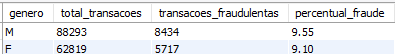

9. Análise por dispositivo

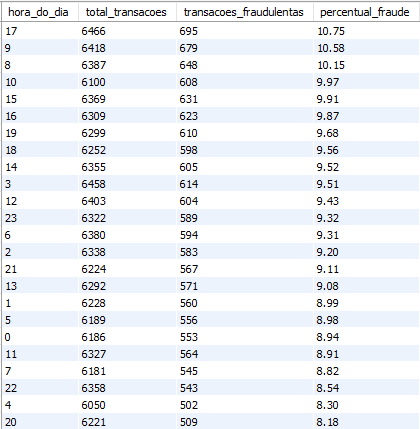

Dispositivos específicos foram usados repetidas vezes para fraudes.

10. Análise por fonte

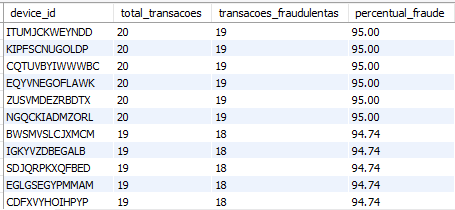

11. Análise por navegador

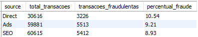

## 📊 Principais insights:
* 9,36% das transações foram identificadas com fraudulentas.
* O prejuízo total com fraudes alcançou $ 523.488,00.
* Padrão suspeito: dispositivos específicos foram usados para múltiplas fraudes.
